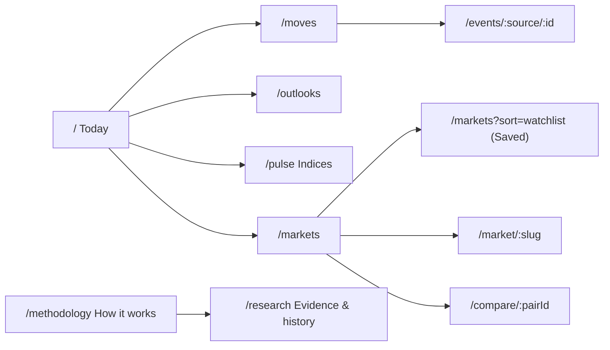

# SPEC-010: Navigation, page structure and the Guide

Status: design approved for implementation (rev 3, 2 October 2026: simplified) · Owner: product engineering · Target release: v0.2.0

## 1. Problem

Production audit, 1 October 2026 (predpulse.xyz, desktop 1024px, dark theme):

- **One page holds everything.** The homepage is ~7,000px tall and stacks nine features: hero, newsroom, freshness line, event outlooks, policy monitor, closing-soon, across venues, observed moves, indices, the full market table and an "About" block. There is no sense of place or of how the features relate.
- **The header has two links** (`Monitor` → an anchor on the homepage, `Indices` → `/pulse`). Methodology and Evidence & history are only reachable from small inline links.
- **Sub-text clutter.** 104 text runs use 9–11px type. Most cards carry two or three meta lines (venue and quote basis, bid/ask, spread, volume, close, coverage counts, per-card snapshot time). The same snapshot time is shown in up to five places.
- **Help is fragmented.** 17 `MetaNote` popovers use four icon kinds (`freshness`, `method`, `evidence`, `context`) with no consistent meaning. One Fed card shows seven icons. Popover copy starts with mechanics ("Automatically screens the existing sampled Polymarket feed…") rather than why the user should care.
- **No thesis.** Nothing tells a new visitor what Predpulse is *for* or how the features fit together. The hero line is good; it's the only one.
- **Mobile is worse on every count** (audit 2 October 2026, 390×844):
  - The homepage is 11,519px tall, which is 13.6 screens.
  - 131 of 170 tap targets are under 44px: the nav links are 44×16, "Read article" and "Evidence & history" are 16px tall, and the stars are about 24px.
  - 182 text elements are under 12px.
  - The market table is fixed at `min-w-[640px]`, so it scrolls sideways inside a 390px screen.
  - Popovers are anchored to the icon, so they can open partly off-screen.
  - `PageTransition` remounts the whole page, header included, on every route change. Because its key is set in an effect, it also remounts once on first load.

## 2. Thesis (the sentence everything ties back to)

> **Prediction markets put a price on what people expect to happen. Predpulse shows how those expectations are moving — and the evidence behind every number.**

Every feature answers one question in service of that thesis:

| Pillar | Question it answers for the user | Features |
|---|---|---|
| **Moves** | What changed in what people expect? | What changed (policy & economy), Observed moves, Closing soon |
| **Outlooks** | How is a big upcoming event priced? | Event outlooks (elections, deadlines), plus a Fed summary row linking to the Fed view |
| **Indices** | Is today calm or turbulent, and where is attention? | Belief Shift, Fed policy balance (**the single Fed view**), Market Attention |
| **Markets** | What else is trading? | Market table and heatmap, Across venues, Saved |
| **Understand** | Can I trust this, and how does it work? | How it works, Evidence & history |

The newsroom stays on Today because it is the bridge between headlines and odds.

## 3. Principles

1. **Three layers of context.** Most visitors never tap an ⓘ, so the visible layer must carry enough context on its own.
   - **Visible:** the thesis in the hero, and a benefit-first hook (≤ 40 characters, from `guide.hook`) under every page title and section title. Hooks are the copy most people will read. Product signs off on them before PR 2 merges.
   - **One tap:** the Guide entry: why it matters → what you see → how to read it.
   - **Deep:** limits and method in the Guide's collapsed section, and full method on `/methodology`.
2. **Context first.** Every explanation opens with why it matters to the user, then what they see, then how to read it, then the limits. Never open with the mechanics.
3. **One place to learn.** Explanations live in one registry (`lib/guide.ts`) and render through one component (the Guide panel). Pages show data, not paragraphs.
4. **Caveats move, they don't disappear.** Every limitation in today's popovers is a deliberate honesty constraint from SPEC-002 to SPEC-009. Each one must exist in the Guide or on `/methodology` after this change. Deleting a caveat requires an explicit spec decision.
5. **One meta line per card.** A card shows its title, its number and at most one line of meta. Everything else is one tap away.
6. **Say it once.** Snapshot freshness and venue source are shown once per page, not per card. Each subject has one home: the Fed meeting distribution appears only in the Fed policy balance view.
7. **Breathing room.** Sections are separated by space, not by borders and labels.

## 4. Information architecture



| Route | Status | Contents |
|---|---|---|
| `/` Today | Reworked | Hero, Today's briefing (3 tiles), Newsroom, Explore grid |
| `/moves` | **New** | Saved-market changes, What changed (12), Observed moves, Closing within 7 days |
| `/outlooks` | **New** | A Fed summary row first (meeting date, leading outcome, lean; links to `/pulse?index=fed-policy-balance`), then the other event outlook cards |
| `/pulse` Indices | Unchanged URL | Indices. `/pulse` stays canonical (see SEO doc). `?index=fed-policy-balance` is the single Fed view |
| `/markets` | **New** | `MarketTable` (table and heatmap), Across venues strip above the table |
| `/methodology` | Retitled "How it works" | Thesis → pillars → measure details → data and evidence |
| `/research` | Gets the shared header | Unchanged content |

Data: all new pages read the same `/api/bootstrap` snapshot through SWR, which is already CDN-cached. No new venue requests, publisher work or Blob writes. `/#monitor` stays as an anchor on Today (hash links cannot redirect server-side), pointing at the briefing tile that links to `/moves`.

## 5. Site menu

### 5.1 Header (all pages)

```
┌──────────────────────────────────────────────────────────────────────────────┐
│ ∿ Predpulse BETA   Today  Moves  Outlooks  Indices  Markets   ◷ 6:38 PM  ★3  ☾  ⊞ │
└──────────────────────────────────────────────────────────────────────────────┘
                                                       │        │       │
                                    global freshness chip   saved   Explore (opens panel)
```

- **Primary links** (≥ `md`): the five pillars. The active route gets `text-foreground` plus a 2px `primary` underline, set via `aria-current="page"`.
- **Freshness chip**: the *only* place the snapshot time appears site-wide. States: `Updated 6:38 PM` (hourly, muted), `Delayed · 6:38 PM` (amber dot), `Last known · Oct 1` (rose dot). Clicking it opens the Guide on the `freshness` entry. This replaces the freshness line in `HomeDashboard`, the per-card `Snapshot …` lines in `RelatedPairCard`/`DecisionDistributionSection`, and the captured-at line in `IndicesSection`.
- **Saved** (star + count from `getWatchlist()`): links to `/markets?sort=watchlist`. Hidden when the count is 0.
- **Explore** (`LayoutGrid` icon, label visible ≥ `lg`): opens the Explore panel. Shows as the hamburger below `md`. No keyboard shortcut until search ships (§5.4).
- Header height is a fixed 56px. It stays sticky with backdrop blur.
- **Mobile header (< md)** is only logo · freshness dot · menu button: `∿ Predpulse  ●  ☰`. The full row would need about 380px of the 358px available. The freshness chip shrinks to a 44×44 status dot that opens the `freshness` Guide entry. Theme and Saved move into the menu sheet. The BETA badge hides below 360px.
- `HeaderBar` moves into `app/layout.tsx`, outside `PageTransition`, so it never remounts or re-animates between pages.

### 5.2 Explore panel (desktop ≥ md)

A full-width panel drops below the header (max-width `screen-xl`, 24px padding, `rounded-b-2xl`, `shadow-xl`), with a 150ms fade and 8px slide (`motion-safe` only).

```
┌──────────────────────────────────────────────────────────────────────────────┐
│ FOLLOW                    MEASURE                    BROWSE                   │
│ ↗ Moves                   ∿ Belief Shift             ▦ Markets                │
│   What changed today        Calm day or turbulent?     Every market, one table│
│   Top move +18 pp                                                             │
│ ◎ Outlooks                ⚖ Fed policy balance       ⇄ Across venues          │
│   How big events are priced Which way the Fed leans    Same question, two     │
│                             Hold leads · +21.5         prices                 │
│ ▤ Newsroom                ▧ Market Attention         ★ Saved                  │
│   Headlines next to odds    Where activity is          Your markets, on this  │
│                             concentrating              device                 │
│──────────────────────────────────────────────────────────────────────────────│
│ UNDERSTAND   ⓘ How Predpulse works   ⛨ Evidence & history     ◷ Updated 6:38 PM│
│ "Prediction markets put a price on what people expect to happen…"            │
└──────────────────────────────────────────────────────────────────────────────┘
```

- Each entry has an icon, a name and a **hook** (≤ 40 characters, written from the user's side, taken from `guide.hook`).
- **Only two entries carry a live stat** (≤ 28 characters): Moves (the largest 24h move) and Fed policy balance (leading outcome and lean). These draw people in; more would mean selector code and empty-state tests for little gain. The stat is omitted whenever its data is unavailable, stale or in a warming state. It never shows a placeholder or a zero.
- Live stats come from the SWR `/api/bootstrap` cache. On routes that don't already load it (`/pulse`, `/methodology`, `/research`), the fetch starts on first panel open, not on page load.
- The footer always shows the thesis line and the freshness chip.
- On first visit (no `predpulse:onboarded:v1` in localStorage), "How Predpulse works" gets a subtle `New here?` pill. The key is set the first time the panel is opened.

### 5.3 Mobile (< md)

- **No bottom tab bar** (product decision, §11). Pillar switching goes through the menu sheet, so the sheet is designed to make it two quick taps.
- **Menu sheet** (☰): a bottom `Sheet` (§5.5) that snaps to 60% height, can be dragged to full height, and is dismissed by swiping down, tapping the backdrop or using the back gesture. It opens in under 150ms, with no data needed to render.
  1. **Pillars first**, at the top and in thumb reach once the sheet is open: a 5-cell grid (Today, Moves, Outlooks, Indices, Markets), each 64px tall with icon and name. The current pillar is highlighted.
  2. Then the remaining Explore entries as 48px rows (icon, name, hook; the two live stats on the right): the features inside each pillar, plus Newsroom and Across venues.
  3. Then Understand (How it works, Evidence & history), Saved, Theme, and the thesis with freshness at the bottom.
- **Continue links:** each pillar page ends with one "Next: Outlooks →" card in the order Today → Moves → Outlooks → Indices → Markets, so a phone user reading top to bottom never needs to scroll back up to the ☰.
- Body scroll is locked while a sheet is open, without layout shift (`scrollbar-gutter: stable` on desktop; no shift on iOS).

### 5.4 Search (later, optional PR)

Search and its `⌘K` / `Ctrl K` shortcut ship together, or not at all. It is a filter input at the top of the Explore panel, searching the panel entries plus the already-loaded snapshot (`markets.markets` + `monitorMarkets`), client-side, with no new API. Phase 1 has no shortcut and no input.

### 5.5 Accessibility

- The trigger is a disclosure button (`aria-expanded`, `aria-controls`). Don't use `role="menu"`, because the entries are navigation links.
- `Esc` closes the panel and returns focus to the trigger. Clicking outside closes it. Following a link closes it.
- **One `Sheet` primitive** (`components/ui/sheet.tsx`) on `vaul@1.1.2`, pinned exactly (no caret), consistent with the existing Radix pins. `vaul` is built on Radix Dialog, so it supplies the focus trap, `Esc`, focus return and scroll lock. It takes `direction="right"` for the desktop Guide and `direction="bottom"` for all mobile sheets. The menu, Guide, evidence (mobile) and index details (mobile) all use it: one behaviour, one set of tests, no second dialog library. The desktop Explore panel is a plain disclosure region, not a dialog.
- **Back closes sheets.** Opening any sheet pushes a history entry. The Android back button, the iOS edge swipe and the browser back button then close the sheet instead of leaving the page. Closing with ✕, a swipe or the backdrop calls `history.back()` when that entry was pushed by the app.
- **Only shareable states change the URL:** `?guide=<id>` and `?index=<id>`. The menu sheet pushes a state-only entry (`history.pushState({ sheet: "menu" }, "")`) with no query parameter.
- All targets are ≥ 44×44px. Colour is never the only state indicator.

## 6. The Guide (centralized explanations)

### 6.1 Registry: `lib/guide.ts`

```ts
export type GuideId = "thesis" | "freshness" | "moves" | "observed-moves" | "closing-soon"
  | "outlooks" | "belief-shift" | "policy-balance" | "market-attention"
  | "across-venues" | "newsroom" | "markets" | "saved" | "evidence";

export interface GuideEntry {
  id: GuideId;
  name: string;
  pillar: "follow" | "measure" | "browse" | "understand";
  hook: string;            // ≤ 40 chars, for the menu and Today tiles
  why: string;             // 1–2 sentences: the user's benefit, tied to the thesis
  see: string[];           // what is on screen, ≤ 3 bullets
  read: string[];          // how to interpret it, ≤ 3 bullets
  limits: string[];        // honesty constraints, moved verbatim-in-meaning from MetaNotes
  method?: string;         // anchor on /methodology for full method detail
  related: GuideId[];      // "Works well with" links (cohesion)
}
```

`MEASURES` in `IndexGuide.tsx` gets folded into this registry. `/methodology` and `IndexGuide` render from it, so crawlers and visitors keep seeing the same static text (SEO doc requirement).

### 6.2 Guide panel

- The shared `Sheet`: a 420px right-hand sheet on desktop. On mobile it is a bottom sheet: it opens at 60% height so the section behind stays visible for context, drags to 92dvh, and swipes down to close. It has a drag handle, and the ✕ sits at the top-right of the sheet. Content scrolls inside the sheet and never scrolls the page behind it.
- It opens from any section's `ⓘ` button, the freshness chip and the Explore panel. It is URL-addressable via `?guide=<id>`, so support and social links can deep-link an explanation. The history entry is pushed, so back closes it (§5.5). "Works well with" chips replace that entry, so switching topics doesn't stack history.
- Content order is fixed:

```
┌───────────────────────────────┐
│ BELIEF SHIFT              ✕   │
│ Is today calm or turbulent?   │  ← hook as title support
│                               │
│ Why it matters                │  ← `why`, 15px, foreground
│ What you're seeing            │  ← `see`
│ How to read it                │  ← `read`
│ ▸ Limits & method             │  ← collapsed <details>: `limits` + link to /methodology#id
│                               │
│ Works well with               │  ← `related` chips → open that entry
│ [Fed policy balance] [Moves]  │
└───────────────────────────────┘
```

### 6.3 Icon system (replaces the four `MetaNote` kinds)

| Icon | Meaning | Opens | Placement |
|---|---|---|---|
| `Info` ⓘ | "What is this and why should I care?" | Guide panel at the section's entry | **One per section header.** Never on cards or rows |
| `ShieldCheck` ⛨ | "Show me the evidence for this number" | Item-level provenance: contract question, rules excerpt, bid/ask, fingerprint, venue time | Desktop: per contract or row, revealed on row hover/focus. **Touch: one ⛨ per card footer**, which opens an evidence sheet listing every contract in that card. A per-row icon would bring back on mobile the clutter we remove on desktop |

- On touch devices (`@media (hover: none)`), nothing may depend on hover. Every existing or proposed tooltip (`ui/tooltip.tsx`, HeatmapView, ExpandedPanel, the §7 settlement badge, the Liquid toggle) must be tap-to-open, or have its text placed where it can be read without hover.
- `EvidencePopover` renders as an anchored popover on desktop that flips and clamps to stay inside the viewport, and as the bottom `Sheet` on mobile. It is never a box that can clip off-screen.

`freshness`, `method` and `context` are retired as kinds. `MetaNote` remains only as the evidence popover (rename it to `EvidencePopover`). Card-level method popovers ("How to read these contract prices", "Why these markets appear together") merge into the section's Guide entry. "How this decision outlook works" merges into `policy-balance`.

### 6.4 Copy rules

1. `why` opens with the user's situation or benefit, in second person. It never opens with "This", "Shows", "Automatically", "Calculates" or a venue name.
2. Tie `why` back to the thesis (expectations, how they move, evidence).
3. Plain words: "odds" or "chance" in `why`/`see`. "YES midpoint", "pp" and "quote basis" only appear in `read`/`limits`.
4. No accuracy, causal or trading claims (existing constraint from SPEC-002/006).
5. Length: `why` ≤ 45 words, each bullet ≤ 25 words.

### 6.5 Draft copy (implementers use this; product signs off in PR)

**thesis** — *Why:* Prediction markets put a price on what people expect to happen, from a Fed decision to an election. Predpulse shows how those expectations move each day, and lets you check the evidence behind every number. *Limits:* Hourly snapshots of a selected sample of Polymarket, Kalshi and Manifold markets, not live prices or every market. Not financial advice.

**freshness** — *Why:* Every number here is a dated snapshot, so you always know how current a reading is before you rely on it. *Read:* Updated = within the hourly schedule. Delayed = the latest publication is late. Last known = more than three hours old; movers are withheld. *Limits:* Selected universe counts (`sourceCounts`) appear here.

**moves** — *Why:* When the odds on a policy or economic question jump, people's expectations have changed. See the biggest shifts of the last 24 hours in one place, screened so thin or noisy markets don't drown out real moves. *Read:* The change is in percentage points: 40% → 43% is +3 pp. Star a market to see how it has moved since your last visit. *Limits:* existing "How moves qualify" text; sampled universe; changes don't explain causes or predict outcomes.

**observed-moves** — *Why:* Big moves across all topics, not just policy, each with the trading activity behind it so you can judge how much weight it deserves. *Limits:* existing "About observed moves" text, including the Kalshi last-trade basis and the Manifold exclusion.

**outlooks** — *Why:* Big scheduled events have several possible outcomes. See how the market prices each one side by side, so you can see the likely result and how close the alternatives are. *Read:* Each bar is the chance the market assigns to that contract. *Limits:* existing "How events are selected" and "How to read these contract prices" text (overlapping contracts are not normalized; close times are deadlines, not event dates).

**belief-shift** — *Why:* Is today a calm day or a turbulent one? Belief Shift sums up how much expectations moved across a fixed set of Economics or Politics questions, as one number you can compare day to day. *Read:* Higher means more movement, in either direction. It is not bullish or bearish. *Limits:* existing index MetaNote and `MEASURES.limitation`.

**policy-balance** (the single Fed view) — *Why:* Interest-rate decisions move mortgages, markets and headlines. See which way the next Fed decision leans, toward a hike or a cut, and how likely each outcome is. *Read:* Positive leans hike; negative leans cut. Hold is shown separately. Raw shows each outcome's own price; Normalized rescales the complete set to 100%. *Limits:* Not a probability or an expected rate change; one supported meeting; the existing decision-outlook text.

**market-attention** — *Why:* See which topics traders are most active in right now, and spot when attention shifts from one story to another. *Read:* Area is the share of 24h trading volume; colour is category. *Limits:* Sampled Polymarket events; not sentiment, inflows or the whole market.

**across-venues** — *Why:* The same question can trade at different odds on different venues. Compare them side by side, and see why they may not be the same contract. *Limits:* Similar titles only; separate contracts; settlement may differ.

**newsroom** — *Why:* Read today's headlines next to the markets on the same topic, so you can see where the odds stand on the story. *Limits:* Related by topic matching, not causation.

**markets / saved / evidence** — written by the implementer using the same template, based on the existing `MarketTable`, watchlist and research MetaNote copy.

## 7. Sub-text reduction (component by component)

"→ Guide" means the text moves into that entry's `limits`/`read`. "→ Evidence" means it moves into the row's evidence popover.

| Component | Remove from default view | Destination | Keep visible |
|---|---|---|---|
| `HomeDashboard` | Freshness line + MetaNote; "Markets" eyebrow | Header chip; `freshness` | — |
| `app/page.tsx` | "Prediction markets, measured" About block | `thesis` + Explore grid | Footer (source links, disclaimer) |
| `HeroSection` | Eyebrow "Prediction markets, in perspective" | — | H1 and one-line subhead (the thesis in plain sight) |
| `EventOutlooksSection` | "Evidence & history →" link; section MetaNote; card "Polymarket · YES bid/ask midpoints"; "N selected / M active"; per-contract "YES bid · ask" line; per-contract MetaNotes | `outlooks` Guide; Evidence popover (one per contract, hover-revealed) | Topic eyebrow, title, bars and %, one footer line: `24h volume · View on venue ↗` |
| `DecisionDistributionSection` | Removed from `/outlooks` and Today. It is replaced by a one-line Fed summary row linking to `/pulse?index=fed-policy-balance` | Its Raw/Normalized toggle moves into the Fed policy balance detail; card MetaNotes → `policy-balance`; bid/ask → Evidence | Kept only as a fallback on `/outlooks` when `fed-policy-balance` is withheld but the decision distribution is valid, so a supported meeting never disappears |
| `EventMonitorSection` | "x qualifying / y screened"; per-row line 1 (category · source · basis) and line 2 (spread · volume · closes) | `moves`; Evidence | Question, %, Δ pp, star, **one** meta line: `Category · closes Oct 5` |
| `ObservedMoves` | Coverage counts "P a/b · K c/d"; "24h move" label; footer of volume/liquidity/spread | `observed-moves`; Evidence | Category · venue, question, %, Δ pp |
| `RelatedPairCard` | "Separate contracts · settlement may differ"; basis + close per side; snapshot line; MetaNote | `across-venues` (the settlement caveat also as a `⚠` badge that opens the Guide entry on tap) | Two venues, question, % |
| `IndicesSection` (compact) | "Polymarket · captured samples · Captured …" line; coverage line, unless degraded | Header chip; `belief-shift` | Name, number, scale, a status label only when warming |
| `IndicesSection` (detail) | Inline method paragraphs | `policy-balance` / `belief-shift` limits | Charts, `<details>` evidence lists, Download |
| `MarketTable` | "Hide low-volume / low-liquidity markets" sub-label | `markets` Guide entry | Controls (the existing mobile controls sheet is kept) |
| `/research` | Bespoke header | Shared `HeaderBar` | Content unchanged |

Empty and degraded states (stale, warming, no qualifying events) **stay inline**. They describe the current data, not the feature.

## 8. Layout and spacing

- **Type floor:** 12px for anything a user reads. 10–11px only for uppercase eyebrows and axis ticks. Target: fewer than 25 runs of 9–11px text (from 104).
- **Section rhythm:** `space-y-16` (64px) between sections on desktop, `space-y-10` (40px) on mobile. No `border-t` section dividers.
- **Section header:** an eyebrow (optional, pillar colour) and an H2 (`text-2xl` on pillar pages, `text-xl` on Today), with ⓘ right-aligned and an optional "See all →" link.
- **Cards:** `p-5 sm:p-6`, `rounded-2xl`, `gap-4` grids. A card has at most 3 text styles (title, number, meta).
- **Content width:** pillar pages `max-w-screen-xl`. Reading pages (`/methodology`, `/research`) `max-w-3xl`.
- **Page header (pillar pages):** H1 + hook (from `guide.hook`) + ⓘ. That's it.

### 8.1 Today (`/`) composition — target ≤ 3 desktop viewports

```
Header
Hero (min-h reduced to ~44vh): H1 + thesis subhead + landscape
Today's briefing  ⓘ                                  (3 tiles, md:grid-cols-3)
  ┌ Biggest move ──────┐ ┌ Fed policy balance ─┐ ┌ Belief Shift ──────┐
  │ +18.0 pp           │ │ Hold 77%            │ │ 2.4 pp Economics   │
  │ Ocasio-Cortez/Rubio│ │ Oct 28 · leans hike │ │ calm ▁▂▃ turbulent │
  │ All moves →        │ │ Fed view →          │ │ All indices →      │
  └────────────────────┘ └─────────────────────┘ └────────────────────┘
Newsroom  ⓘ                                          (existing 3 cards)
Explore Predpulse                                    (same entries as the Explore panel, as cards)
Footer
```

Tile fallbacks: if a tile's data is unavailable, show the next available product (Market Attention top category, then Observed move). Never show an empty tile.

### 8.2 Mobile (first-class, designed at 390px, must work at 320px)

**Budgets (enforced by the mobile audit in §9):**

| Measure | Today (390px) | Target |
|---|---|---|
| Today page height | 13.6 screens | ≤ 4 screens |
| Pillar page height (excluding the market list) | n/a | ≤ 5 screens |
| Tap targets under 44×44 | 131 / 170 | 0, except inline links within sentences |
| Text under 12px | 182 elements | Eyebrows, tab labels and axis ticks only |
| Unintended horizontal overflow | Market table | 0. Only designated carousels may scroll sideways |

**Layout:**
- **Today:** the hero is capped at `min-h-[300px]` with the landscape underneath and is about 1 screen. The three briefing tiles stack as compact rows (about 96px each: label, big number, one-line context, chevron), with the whole row tappable. The Newsroom keeps its existing snap carousel. Explore shows as a 2-column grid of icon and name.
- **Cards:** full-bleed within `px-4`. Numbers stay right-aligned in a fixed `tabular-nums` column, so rows scan vertically. Question titles are `line-clamp-2`.
- **Markets (`/markets`):** below `md`, rows render as a 2-line list instead of the 640px table. Line 1 is the question (clamp 2) with %, and line 2 is venue · Δ 24h with ★. Tapping a row expands it in place. Volume and liquidity live in the expansion, not as columns. The sort tabs scroll horizontally with an edge fade, and the active tab scrolls into view. The existing cog bottom sheet for filters stays.
- **Event outlook bars:** the label and % sit on one line above the bar. Long labels wrap rather than truncating the %.
- **Index details (`/pulse`):** tapping a tile opens its detail as a full-height bottom `Sheet` with `?index=<id>` pushed, so back closes it. Today the detail renders below all the tiles, off-screen. Charts get full width and must fit 320px without horizontal scroll.
- **Spacing:** `space-y-10` between sections and `gap-3` inside grids. Spacing is never below 16px between tappable elements. Fixed chrome is the 56px sticky header only, plus the top safe area.

**Fluency:**
- Add `export const viewport = { width: "device-width", initialScale: 1, viewportFit: "cover", themeColor: [...] }` in `app/layout.tsx`, so `env(safe-area-inset-*)` has values on notched phones. Use `dvh`, never `vh`, for sheets.
- The five pillar links use Next `<Link>` with prefetch on, since they are static shells and cheap. Prefetch stays `false` for detail and research links, as today. Switching pillars reuses the shared SWR bootstrap cache, so the second page renders instantly with no loading state.
- **Fix `PageTransition`:** key it on `pathname` directly, not on a counter set in an effect, so there is no remount on first load. Animate only `opacity` and `transform` (max 150ms) under `motion-safe`. Never animate the header.
- **Scroll:** back and forward restore scroll position (the Next default; don't break it with remounts). Pillar-to-pillar navigation starts at the top. Anchors use `scroll-mt-[72px]` to clear the sticky header.
- **Touch:** `touch-action: manipulation` on controls (no double-tap zoom delay). Press feedback via `active:` styles, because hover styles don't apply on touch. No layout shift when SWR data arrives: skeletons match the final card heights.
- **Performance:** the hero `ProbabilityLandscape` pauses its animation when off-screen (IntersectionObserver) and under `prefers-reduced-motion`. Vercel Speed Insights (already installed) mobile p75 targets: LCP ≤ 2.5s, INP ≤ 200ms, CLS ≤ 0.1.

## 9. Implementation plan (independent PRs, merge in order)

0. **Baseline (before PR 1 merges, no code).** Record from Vercel Analytics the last 30 days of page views per route, and the share of visits that go beyond `/`. Record mobile and desktop p75 LCP, INP and CLS from Speed Insights. Run the mobile audit script against production. Run the five-person test (§10) on production. Store the results in `docs/spec-010-baseline.md`.
1. **PR 1 — Foundations.** `lib/guide.ts` (registry + copy, including hooks for product sign-off), `lib/nav.ts` (pillars, routes, icons, the two live-stat selectors and `fedPresentation`, as pure functions of `Bootstrap`), `components/ui/sheet.tsx` on `vaul@1.1.2` (exact pin), `GuidePanel`, `GuideButton`, `EvidencePopover` (renamed `MetaNote`). `/methodology` renders from the registry. No visible change elsewhere.
2. **PR 2 — Header and Explore panel.** `HeaderBar` v2 (moved into `app/layout.tsx`), `ExplorePanel`, `MobileNavSheet`, `FreshnessChip`, a shared `useBootstrap()` hook (extracted from `HomeDashboard`), the `viewport` export, the `PageTransition` fix, and `/research` using `HeaderBar`. Behind `NEXT_PUBLIC_NAV_V2`.
3. **PR 3 — Pillar pages.** `/moves`, `/outlooks`, `/markets` (each with `pageMetadata`, canonical, and added to `sitemap.ts`), and Today recomposed per §8.1. The new Today and the new header are behind `NEXT_PUBLIC_NAV_V2`. With the flag off, the old homepage renders unchanged.
4. **PRs 4a–4e — Sub-text reduction and mobile layout, one page at a time.** Each applies §7, the §8 spacing and type rules and §8.2 to that page's components, and must pass the mobile audit for that page before merge.
   - **4a Today:** `HeroSection`, briefing tiles, Newsroom, Explore grid.
   - **4b Moves:** `EventMonitorSection`, `ObservedMoves`.
   - **4c Outlooks and the single Fed view:** `EventOutlooksSection`, the Fed summary row, the Raw/Normalized toggle moved into the Fed policy balance detail, `DecisionDistributionSection` reduced to fallback-only.
   - **4d Indices:** `IndicesSection` and the mobile index detail sheet.
   - **4e Markets:** `MarketTable`, `MarketRow`, the mobile two-line list, `RelatedPairCard`.
5. **Later, optional — Search** with its `⌘K` shortcut (§5.4).

### Feature flag and rollback

- `NEXT_PUBLIC_NAV_V2=1` in Vercel Preview first, then Production. It is read at build time, so toggling it needs a redeploy (about 2 minutes).
- **What the flag covers:** the new header, the Explore panel and menu sheet, the Today composition, and the header links to the new pages. With the flag off, the old `HeaderBar` and homepage render. The new routes still exist but aren't linked.
- **What the flag does not cover:** PRs 4a–4e change shared components (cards, rows, sections), which also render on the old homepage. Turning the flag off does **not** bring back the old cards. Each of these PRs is deliberately small and rolls back on its own by reverting its merge commit (`git revert -m 1 <merge-sha>`, then PR and merge; no force-push).
- **Manual rollback, fastest first:**
  1. Vercel → Deployments → promote the previous production deployment (instant, reverts everything).
  2. Set `NEXT_PUBLIC_NAV_V2=0` in Vercel → Settings → Environment Variables and redeploy (reverts navigation and Today only).
  3. Revert the specific 4x merge commit (reverts that page's cards only).
- Remove the flag and the old header one release after a stable production run.

### Testing (vitest, node environment, matching the existing setup)

- `lib/__tests__/guide.test.ts`: every `GuideId` has a non-empty `why`/`see`/`read`/`limits`. Length limits from §6.4 hold. `why` doesn't start with a banned opener. `related` ids resolve. Every `method` anchor exists on `/methodology`.
- `lib/__tests__/nav.test.ts`: every nav route is a real app route. The two live-stat selectors return `null` (never `"0"` or a placeholder) for missing, stale or warming data. Hooks are ≤ 40 characters.
- **Single Fed view:** the Outlooks summary/fallback choice is a pure function in `lib/nav.ts`, `fedPresentation(bootstrap) → "summary" | "fallback-card" | null`. Tests assert three cases: `summary` whenever `fed-policy-balance` is available; `fallback-card` only when the benchmark is withheld and the decision distribution is valid; `null` otherwise. The Today tile and the summary row link to `/pulse?index=fed-policy-balance`, and the test asserts that link target. Components only switch on this value.
- **Caveat-preservation test:** a fixture lists the key phrases of every current MetaNote limitation (for example "not a probability", "settlement may differ", "Manifold"). Each must appear in some `GuideEntry.limits` or on the methodology page.
- `seo.test.ts`: new routes have canonical/title/description and appear in the sitemap. `/pulse` stays canonical for indices.
- **Mobile audit** (`scripts/mobile-audit.ts`, `@playwright/test@1.63.0` exact pin, dev dependency only, run against a Preview URL; not part of `vitest`). It loads `/`, `/moves`, `/outlooks`, `/pulse` and `/markets` at 320, 390 and 412px and fails the run on any §8.2 budget breach: page height, sub-44px targets, sub-12px text, horizontal overflow outside elements marked `data-carousel`. Run it in CI on each Preview deployment from PR 2 onward. It replaces the ad-hoc audit used to write this section.
- Coverage of the new `lib/` modules ≥ 85%. Component behaviour (focus trap, Esc, focus return, deep links) is covered by the UAT script below until a DOM test environment is introduced.

### UAT script (run on the Preview deployment with the flag on)

1. Desktop: open Explore, tab through it, press `Esc`, and check that focus returns to the trigger. Each entry routes correctly and the active pillar is underlined. Only Moves and Fed policy balance show live stats. Opening the menu adds no query parameter.
2. Mobile, on **real devices**: iPhone Safari (notched phone, plus an SE at 320–375px) and Android Chrome. Emulation misses safe areas, backdrop blur and gesture conflicts.
   - The menu, Guide, evidence and index sheets open with a swipe-able handle, swipe down to close, and close with the back gesture without leaving the page.
   - The background doesn't scroll behind an open sheet.
   - The menu sheet's bottom rows clear the home indicator.
   - ☰ → pillar takes two taps.
   - Switching pillars shows no blank loading state on the second page, and the header doesn't flicker.
   - Each pillar page ends with its "Next" card.
   - `/markets` has no sideways scroll. Rows expand in place.
   - Every control responds on the first tap (no double-tap zoom) and shows press feedback.
   - Rotating to landscape breaks nothing.
   - The mobile audit script passes.
3. Open ⓘ on each section. The Guide opens on the correct entry, "Works well with" chips switch entries, and `?guide=belief-shift` deep-links.
4. The snapshot time appears exactly once per page (header chip). A stale snapshot shows the rose state and the movers' inline stale state.
5. The Fed distribution appears in one place only. The Today tile and the Outlooks summary row both open `/pulse?index=fed-policy-balance`, and the Raw/Normalized toggle works there.
6. JavaScript disabled: `/methodology` and `/pulse` still show the product descriptions (SEO requirement).
7. Today fits in ≤ 3 viewports at 1440×900, and no empty briefing tile is ever shown.

## 10. Success measures

All are compared against the PR 0 baseline, using Vercel Analytics and Speed Insights (already installed; no new tracking).

**Comprehension: a five-person test, run before (production) and after (Preview with the flag on).**
- Recruit five people who don't use Predpulse, at least three of them on their own phone. Each session takes 10 minutes, without help.
- Ask, in order:
  1. After 30 seconds on Today: "What is this site for?"
  2. "Where would you check whether the Fed is likely to cut rates?"
  3. "What changed most in the last day?"
  4. "How would you check whether a number can be trusted?"
- **Pass:** at least 4 of 5 describe the thesis in their own words (expectations, how they're changing). Tasks 2–4 are completed by at least 4 of 5 within 60 seconds each.
- Hooks or flows that fail are rewritten before the flag goes to Production.

**Behaviour, 30 days after launch versus baseline:**
- The share of visits that reach a page beyond Today rises.
- `/methodology` views rise (the Guide's deep links lead there).
- Mobile p75 LCP, INP and CLS meet §8.2 and don't regress from baseline.

**Clutter:** the mobile audit passes on every pillar page, and the count of 9–11px text runs is below 25.

## 11. Product decisions (1 October 2026)

- `/moves` keeps both lists: What changed (policy & economy) first, Observed moves (all topics) below.
- Search ships later, with its `⌘K` shortcut. Phase 1 has neither.
- Today leads with the briefing tiles, then the Newsroom.
- No mobile bottom tab bar (2 October 2026). Pillar switching uses the ☰ sheet (pillar grid first) and the per-page "Next" cards. Revisit if mobile analytics show heavy cross-pillar navigation.
- Simplifications (rev 3, 2 October 2026):
  - One Fed view (Fed policy balance), with Outlooks and Today linking to it.
  - One `Sheet` primitive on `vaul`, with no separate Radix Dialog dependency.
  - Only `?guide=` and `?index=` appear in URLs.
  - Live stats on two menu entries only.
  - The sub-text PR is split by page.
  - Three layers of context as the governing principle.
  - A baseline and a five-person test define success.
- Follow-up, not in this spec: the publisher computes the Fed meeting twice (`lib/decision-distribution.ts` and `lib/outcome-benchmark.ts`). Consolidating them is a publisher change for a later spec. This spec only removes the duplication in the UI.

## 12. Out of scope

New data, venues or publisher changes. Accounts. Redesigning chart internals (they must still fit 320px). Changing the `/pulse` URL. A native app or PWA install.
